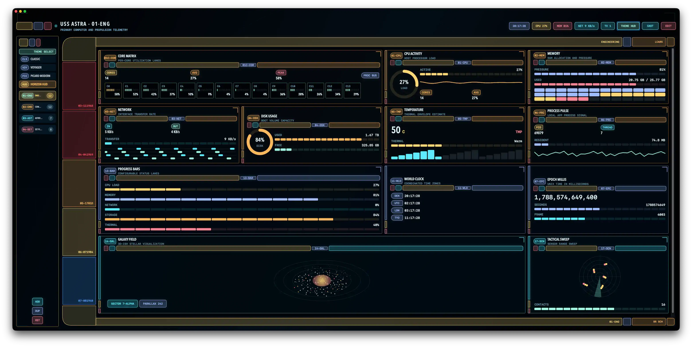

# Spaceship Dashboard

Spaceship Dashboard is a macOS SwiftUI app for cinematic starship-style control surfaces. It uses the original Astra Console Interface design language: warm pill rails, asymmetric elbows, segmented telemetry, dense status panels, and selectable console themes that evoke bridge and deck dashboards without copying a specific protected screen design.

The app runs as a local desktop dashboard. It combines real Mac telemetry with screen-ready mission, navigation, time, and set-console widgets, then lets you assemble those widgets into custom dashboards. The console can be cast to an Apple TV, either through an AirPlay display or with the native tvOS receiver in `AppleTV/`.



> [!NOTE]
> The UI is still experimental.

## Requirements

- macOS 14 or newer
- Swift 6 toolchain
- Xcode with Swift 6 support, if you prefer running from Xcode

## Run

From the repository root:

```bash
./run.sh
```

Pass `--release` for an optimized build. This wraps `swift run SpaceshipDashboard`, which works too, and you can also open the folder in Xcode and run the `SpaceshipDashboard` executable target.

For a double-clickable app with the icon in Finder, the Dock and Launchpad, run `Packaging/make-app.sh --open`: it makes a release build and assembles `.build/SpaceshipDashboard.app` (ad-hoc signed). The Apple TV app carries a layered parallax icon and Top Shelf images in its asset catalog. Both come from one vector design; see `Packaging/icon/README.md`.

## Features

- Hidden-titlebar macOS window with a 1440 x 900 default size and 1180 x 760 minimum layout
- Four Astra Console themes: Classic, Voyager, Picard Modern, and Horizon HUD (a holographic hairline style with its own backdrop and typography)
- Live header telemetry for clock, CPU, memory, network, and active theme
- Dashboard switch boot sequence (progress, boot log, status blocks) and ambient render-server motion (scan sweep, live pulse)
- Built-in dashboards for Engineering, Command Deck, Astrometrics, Set Playback, Dev Ops, Uplink, and Weather Deck
- Custom dashboard builder with persisted layout and theme preferences
- Local telemetry sampling through macOS and Darwin APIs, plus developer telemetry (git, containers, ports, top processes), connectivity (Wi-Fi, latency probes, public IP/DNS/VPN) and weather (Open-Meteo) configured under EDIT › SOURCES
- Cast to an Apple TV: chromeless presentation window for AirPlay displays, and a native tvOS receiver synced over Bonjour

## Built-In Dashboards

- Engineering: CPU core matrix, CPU load, memory pressure, network, disk, thermal estimate, process pulse, and progress lanes
- Command Deck: mission summary, host telemetry, galaxy field, shield grid, power routing, alert log, world clock, and countdown
- Astrometrics: galaxy field, starmap, orbital simulation, tactical sweep, epoch milliseconds, time formats, and world clock
- Set Playback: invented telemetry, animated data matrix, diagnostics loops, comms, crew readiness, shield grid, alert log, and bridge clock
- Dev Ops: system load, repositories, containers, top 10 processes by CPU and by memory, listening ports, CPU load
- Uplink: Wi-Fi link, latency probes, network identity, network rate, world clock, tactical sweep, comms
- Weather Deck: current conditions, sun cycle, air quality, hourly outlook, five-day forecast, multi-city, clocks

## Dashboard Builder

Use the `EDIT` control in the app header to open the builder panel. From there you can:

- Create, duplicate, rename, and reset dashboards
- Add widgets by group
- Remove widgets from the active dashboard
- Reorder widgets
- Resize widgets as Compact, Wide, Tall, or Hero
- Cycle themes from the header

Dashboard layouts and theme selection are saved in `UserDefaults` under the app's keys. The store also migrates older saved dashboard data into the current default dashboard set.

### Sources

The builder's `SOURCES` tab configures the optional telemetry categories (Mac only; the Apple TV receives the results over the sync link):

- Repositories: folders whose git status (branch, staged/modified/untracked counts, ahead/behind, last commit) the Repositories widget shows. Type a path or `PICK` folders.
- Latency hosts: `host` or `host:port` entries probed with a TCP connect every 10 seconds (default 1.1.1.1:53, apple.com:443, github.com:443).
- Weather locations: searched through Open-Meteo geocoding; the first entry is the primary location used by the single-location weather widgets, the rest appear in Multi-City. Defaults are Cupertino and London until you add your own.
- Units: metric or imperial for temperature, wind, pressure and precipitation.

Settings persist in `UserDefaults` (`spaceship-dashboard.sources.v1`).

## Casting to an Apple TV

There are two ways to put the console on a TV. Both keep the Mac as the remote: pick dashboards and themes in the Mac window and the TV follows.

### AirPlay display (no install on the Apple TV)

1. In Control Center on the Mac, choose Screen Mirroring → your Apple TV → **Use As Separate Display**.
2. The dashboard notices the new display and opens a chromeless, full-screen console on it (header telemetry plus the dashboard canvas; no sidebar, builder or buttons; pointer hidden; TV-safe margin). Presentation surfaces scale the dashboard to fit the screen height, so a deck with three rows of telemetry fills a 1080p TV without scrolling. If you would rather start it by hand, use the `CAST` button in the header, the **Cast** menu, or ⇧⌘P, and turn off *Cast Automatically When a Display Appears* in the same menu.
3. While casting, the Mac window turns into a remote: the widgets render exactly once, on the TV, and the main window shows the dashboard list, builder and a `STOP CAST` control. `EDIT` still works, so layouts can be tuned live on the TV.

Latency is that of AirPlay display mirroring (a fraction of a second). macOS has no public API to start AirPlay mirroring, so step 1 stays manual.

### Native tvOS receiver (`AppleTV/`)

The Apple TV app renders the same console natively at 60 fps and needs only ~1 KB/s from the Mac: the Mac advertises itself over Bonjour (`_spaceship._tcp`) and pushes a telemetry snapshot once a second plus the layouts, selection and theme whenever they change. The Apple TV keeps the last synced layouts, so the Set Playback and Astrometrics decks work even with the Mac asleep; the system widgets show placeholder values until a Mac is back.

- Build and run in the tvOS Simulator with `./run-tv.sh` (needs Xcode with a tvOS simulator runtime).
- For a real Apple TV, create `AppleTV/Signing.local.xcconfig` (git-ignored) containing `DEVELOPMENT_TEAM = <your team ID>` — and optionally your own `PRODUCT_BUNDLE_IDENTIFIER` — then open `AppleTV/SpaceshipDashboardTV.xcodeproj`, pair the Apple TV in Xcode (Devices and Simulators) and run. Signing lives in `AppleTV/Signing.xcconfig`, so the project file never needs editing. The first launch asks for local-network permission, which the receiver needs to find the Mac.
- The Siri Remote works as a second remote control: swipe or click left/right to change dashboards and press play/pause to cycle themes. When linked, the Mac follows.
- The header chip on the TV shows the link state (`LINK · <mac name>`); on the Mac it shows `TV n` while receivers are connected.

The Mac app needs no configuration: it starts advertising as soon as it launches. Both sides run the network layer off the main thread with latest-wins send queues, so a slow or sleeping Apple TV drops snapshots instead of ever backing up into the UI.

## Widget Catalog

Every widget is described, with a screenshot, in [docs/TELEMETRY.md](docs/TELEMETRY.md). The short list:

System widgets:

- CPU Activity
- Core Matrix
- Memory
- Network
- Disk Usage
- Temperature
- Process Pulse

General widgets:

- Epoch Millis
- Time Formats
- Bridge Clock
- Calendar
- World Clock
- Countdown
- Progress Bars

Space widgets:

- Galaxy Field
- Planet Orbits
- Starmap
- Tactical Sweep

Set Console widgets:

- Fake Telemetry
- Data Matrix
- Diagnostics

Mission Ops widgets:

- Mission Status
- Crew
- Shield Grid
- Life Support
- Power Grid
- Comms
- Alert Log

Developer widgets:

- System Load
- Top CPU
- Top Memory
- Repositories
- Containers
- Listening Ports

Connectivity widgets:

- Wi-Fi Link
- Latency
- Network Identity

Weather widgets:

- Conditions
- Hourly Outlook
- Forecast
- Air Quality
- Sun Cycle
- Multi-City

See [docs/TELEMETRY.md](docs/TELEMETRY.md) for a description and screenshot of every widget, grouped by builder tab.

## Telemetry Notes

The system widgets read CPU, per-core CPU, memory, network interface counters, disk capacity, process thread count, and resident memory from public macOS and Darwin APIs; nothing leaves the machine for them.

Developer telemetry runs short local tools off the main thread with timeouts: `ps` (top processes, every 3 s), `git status --porcelain=v2` and `git log -1` for each configured repository, `docker ps` / `docker stats` when a Docker, OrbStack or Podman CLI is found, and `lsof -iTCP -sTCP:LISTEN` for listening ports (every 15 s). Load average and swap come from `getloadavg` and `sysctl vm.swapusage`.

Connectivity telemetry reads the Wi-Fi link through CoreWLAN (macOS withholds the SSID unless the app has Location permission, so it may show `HIDDEN`), times TCP connects to the configured hosts, reads DNS servers from `/etc/resolv.conf`, detects VPNs via `scutil --nc list` and tunnel interfaces, and asks `api.ipify.org` for the public IP every 5 minutes. Weather and air quality come from the free, keyless Open-Meteo API every 10 minutes. These are the only network calls the app makes.

macOS does not expose exact sensor temperatures through public Swift APIs. The temperature widget estimates a practical thermal envelope from CPU load, memory pressure, network activity, and `ProcessInfo.thermalState`.

## Project Layout

```text
Package.swift
Sources/AstraConsole/            shared library: everything below builds for macOS and tvOS
  App/
    SpaceshipDashboardApp.swift  macOS app (window, Cast menu)
    SpaceshipTVApp.swift         tvOS receiver app
  Platform/PlatformShims.swift   AppKit/UIKit host view for the Core Animation overlays
  Presentation/
    PresentationRootView.swift   chromeless console surface (AirPlay window and Apple TV)
    PresentationController.swift external-display window management (macOS)
  Sync/
    SyncMessages.swift           wire protocol (length-prefixed JSON)
    ConsoleSyncTransport.swift   Bonjour listener/browser, framed connections (off-main)
    ConsoleSyncCoordinators.swift main-actor glue: publisher (Mac) and receiver (Apple TV)
  AnimationPhaseView.swift
  AstraConsoleTheme.swift
  ConsoleViews.swift
  CoreAnimationOverlays.swift
  DashboardStore.swift
  DashboardTransitionController.swift
  FakeAndMissionWidgets.swift
  Formatters.swift
  Models.swift
  SpaceWidgets.swift
  SystemTelemetry.swift
  SystemWidgets.swift
  TimeWidgets.swift
  WidgetCanvasDrawing.swift
Sources/SpaceshipDashboard/main.swift   macOS executable entry point
AppleTV/
  SpaceshipDashboardTV.xcodeproj  tvOS app target depending on the AstraConsole package
  SpaceshipDashboardTV/           main.swift, Info.plist (local-network usage + Bonjour service)
Tests/SpaceshipDashboardTests/
  PerformanceHarness.swift
research/astra-console-interface/
```

The `research/astra-console-interface` folder contains the design research, source notes, and reference images that informed the Astra Console Interface visual language.

## Development

Build the package:

```bash
swift build
```

Run the app:

```bash
swift run SpaceshipDashboard
```

Run the tests:

```bash
./test.sh
```

Arguments are forwarded to `swift test`, e.g. `./test.sh --filter "Builder toggle"`.

The test target is a performance harness that guards the UI's latency budgets: dashboard switches and builder toggles must be synchronous, animation pausing must never be coupled to user-visible toggles, store mutations must stay in-memory with persistence debounced, and date formatters must be cached.

## Performance Architecture

The app is built to animate continuously without meaningful CPU cost. The rules that keep it that way:

- **One aligned clock.** Ambient animations run through `AnimationPhaseView` / `ConsoleTimelineView`, whose `AlignedPeriodicSchedule` shares a single epoch, so simultaneous widget ticks coalesce into one main-thread wakeup at the widget's own frame rate (typically 6–20 Hz — most console effects don't need more).
- **Ticks invalidate a Canvas, not a view tree.** Anything that changes per tick is drawn in a single `Canvas` (see `WidgetCanvasDrawing.swift`); static chrome lives outside the timeline closure. Never put stacks of `Text`/`SegmentedBar` views inside a timeline tick.
- **Steady-state loops run on the render server.** The tactical sweep and flowing dash routes (`CoreAnimationOverlays.swift`) are Core Animation layers: once installed they cost zero app CPU per frame.
- **Transitions are synchronous.** `DashboardTransitionController` switches dashboards with no sleeps or settle timers; the boot flash is a cosmetic overlay above the already-mounted dashboard, and it is the only thing allowed to pause widget animations.
- **State is `@Observable` and persistence is debounced.** Views depend on exactly the properties they read, and layout mutations are in-memory edits with a debounced JSON write behind them.
- **Casting never touches the render path.** While presenting, the Mac window drops its widget canvas so the dashboard is rendered once; the Bonjour layer (`Sync/ConsoleSyncTransport.swift`) is queue-confined, encodes off-main and sends latest-wins, so nothing about the network can stall the main thread.

## License

Spaceship Dashboard is available under the MIT License. See [LICENSE](LICENSE).
